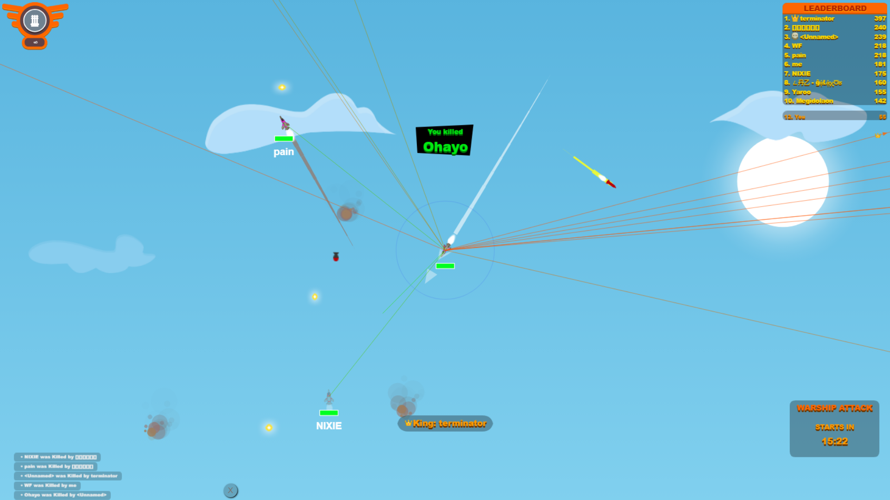

<h1 id="tsu" align="center">🪽 Tsu-Wings - (tech demo)</h1>

  
  

---

# 🕹️ Wings.io Player ESP & Aim Bot

Enhance your Wings.io gameplay with **Player ESP** and **Aim Bot** features.

## ⚡ Features

- Highlight players (ESP)  
- Aim assistance for easier targeting  
- Lightweight and efficient script
- [Wings.io](https://wings.io/)
---

<h2 align="center">🖼️ Tech-Demo</h2>

  

---

## 🛠️ Installation

- 🖥️ Install <a href="https://chromewebstore.google.com/detail/tampermonkey/dhdgffkkebhmkfjojejmpbldmpobfkfo" target="_blank"><strong>Tampermonkey</strong></a>/<a href="https://chrome.google.com/webstore/detail/violentmonkey/jinjaccalgkegednnccohejagnlnfdag" target="_blank"><strong>Violentmonkey</strong></a> browser extension  
- 📥 Download the script: <a href="./TsuWings.user.js" target="_blank">TsuWings.user.js</a>  
- 🔧 Open Tampermonkey/Violentmonkey → <a href="https://greasyfork.org/en/scripts/551532" target="_blank"><strong>Import Script</strong></a> → Select the Install this script 
- 🚀 Script is automatically activated — enjoy <a href="https://wings.io/" target="_blank">game</a> tracking

## 📜 License

MIT © 2025 [Qwyua](https://github.com/qwyua)
